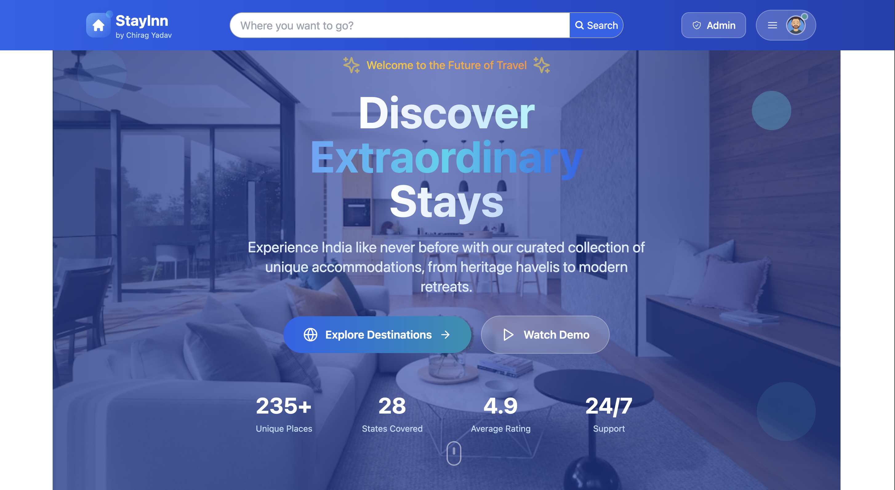

# 🏨 StayInn

(./screenshots/homepage-hero.png)

> **StayInn** is a modern, full-stack travel accommodation platform for India, inspired by Airbnb, built with a futuristic blue theme and crafted by [Chirag Yadav](https://github.com/chirag-tech210).

---

## 🚀 Live Demo

🌐 [View StayInn Online](https://your-deployment-url.com)

---

## ✨ Features

- 🌏 **Location-based Listings:** Find unique stays across all Indian states and major cities
- 📸 **Location-specific Images:** Each place features beautiful, relevant Unsplash images
- 🔒 **Authentication:** Register, login, Google OAuth, JWT-based sessions
- 🏢 **Admin Panel:** Role-based access, blue-themed dashboard
- 🖼️ **Image Upload:** Cloudinary integration for fast, reliable image hosting
- 👤 **Modern Profile:** Editable user profiles with Unsplash avatars
- 🎨 **Futuristic UI:** Blue gradients, glassmorphism, smooth animations, and responsive design
- 📱 **Mobile Friendly:** Fully responsive for all devices

---

## 🖼️ Screenshots

### 🏠 Homepage - Hero Section

*Futuristic hero section with sliding background images, animated elements, and gradient text*

### 🏠 Homepage - Features Section

*Why Choose StayInn section with animated feature cards*

### 🏠 Homepage - Explore Section

*Explore amazing places section with place cards*

### 🔐 Authentication Pages

*Modern login page with blue gradient theme*


*User registration page with form validation*

### 🏢 Admin Dashboard

*Role-based admin panel with blue theme and user management*

### 📍 Places Listing

*Browse all available places with search and filtering*

### 🏡 Individual Place Page

*Detailed view of a specific place with booking widget*

### 👤 User Profile

*User profile page with editable information and booking history*

### 📱 Mobile Responsive

*Fully responsive design that works perfectly on all devices*

---

## 🛠️ Tech Stack

- **Frontend:** React, Vite, TailwindCSS, Radix UI, Lucide Icons
- **Backend:** Node.js, Express, MongoDB (Mongoose), JWT, Cloudinary
- **Auth:** Google OAuth, JWT
- **Deployment:** Railway (or Vercel/Render/Heroku)
- **Other:** Unsplash for images, modern blue branding

---

## 🚦 Quick Start

### 1. Clone the Repo

```bash
git clone https://github.com/chirag-tech210/stayinn.git
cd stayinn
```

### 2. Install Dependencies

```bash
npm run install-all
```

### 3. Set Up Environment Variables

Create `.env` files in `/api` and `/client` as described in [DEPLOYMENT.md](./DEPLOYMENT.md).

### 4. Run Locally

```bash
npm run dev
```
- Frontend: [http://localhost:5173](http://localhost:5173)
- Backend/API: [http://localhost:4000/api](http://localhost:4000/api)

---

## 🚀 Deployment

See [DEPLOYMENT.md](./DEPLOYMENT.md) for full instructions (Railway, Render, Heroku).

---

## 🙋 FAQ

- **How do I add new places?**  
  Register/login, go to your account, and use the "Add new place" button.

- **How do I become admin?**  
  Set your user's `role` to `admin` in the database.

- **How do I change the branding?**  
  Edit the logo, colors, and text in `/client/src/components/ui/Header.jsx` and `/client/index.html`.

---

## 👨‍💻 Author

- **Chirag Yadav**  
  [GitHub](https://github.com/chirag-tech210) | [LinkedIn](https://www.linkedin.com/in/chirag-yadav/)

---

## 📸 How to Add Screenshots

1. **Create a screenshots folder:**
   ```bash
   mkdir screenshots
   ```

2. **Take screenshots of your app:**
   - Homepage (hero section)
   - Homepage (features section)
   - Homepage (explore section)
   - Login page
   - Register page
   - Admin dashboard
   - Places listing page
   - Individual place page
   - User profile page
   - Mobile view

3. **Save screenshots with descriptive names:**
   - `homepage-hero.png`
   - `homepage-features.png`
   - `homepage-explore.png`
   - `login-page.png`
   - `register-page.png`
   - `admin-dashboard.png`
   - `places-page.png`
   - `place-detail.png`
   - `user-profile.png`
   - `mobile-view.png`

4. **Add them to your repository:**
   ```bash
   git add screenshots/
   git commit -m "Add app screenshots"
   git push
   ```

---

## ⭐️ Show Your Support

If you like this project, please ⭐️ the repo and share it!

---

> **StayInn** – The future of Indian travel, built with ❤️ by Chirag Yadav
